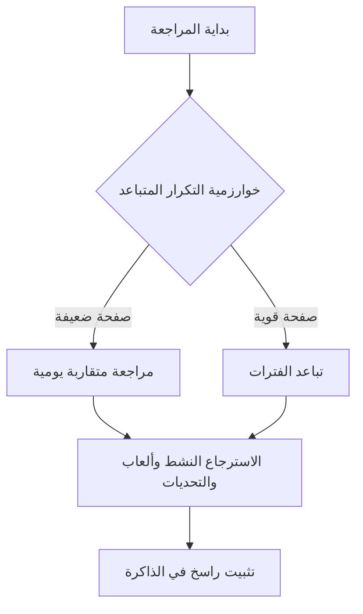
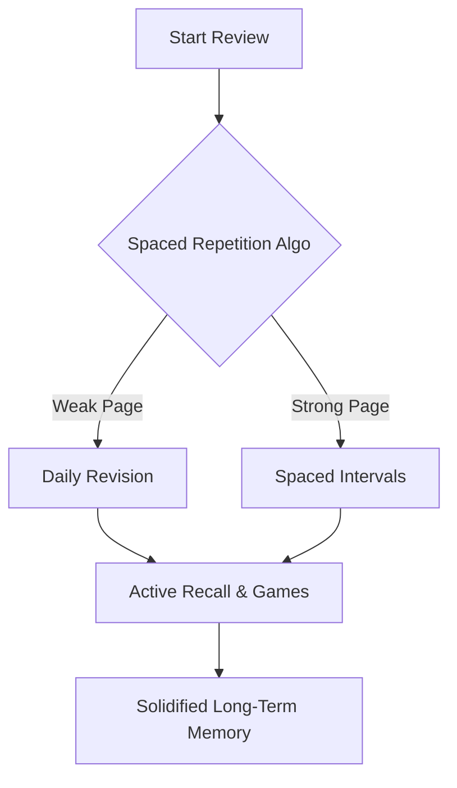

# رصين 🚀✨

> "تعاهدوا هذا القرآن، فوالذي نفس محمد بيده لهو أشد تفلتاً من الإبل في عقلها"

# Raseen 🚀✨

> "Commit yourself to the Quran, for by Him in Whose Hand is my soul, it slips away faster than a camel from its binding."

---

## روابط التحميل المباشر

يسرنا توفير نسخ التشغيل الجاهزة للتحميل المباشر للتطبيق دون الحاجة لخطوات بناء معقدة:
- نسخة أجهزة الكمبيوتر: لتشغيل التطبيق كبرنامج مستقل على نظام ويندوز، يمكنك تحميل ملف التثبيت المباشر للكمبيوتر.
- نسخة الهواتف الذكية: لتشغيل التطبيق على هاتف المحمول، يمكنك تحميل ملف التثبيت المباشر للأندرويد وتثبيته فوراً.
الرابط الرسمي لكافة الإصدارات والملفات: [صفحة إصدارات المشروع على غيت هاب](https://github.com/waleed-kasim/Tathbeet/releases)

## Direct Download Links

We are pleased to provide pre-built binaries for direct installation:
- **Desktop Version (Windows):** Download the standalone installer package (`.exe`) to run the application natively on your computer.
- **Mobile Version (Android):** Download the mobile installer package (`.apk`) and load it directly onto your smartphone.
Official Releases & Assets Page: [Project Releases Page on GitHub](https://github.com/waleed-kasim/Tathbeet/releases)

---

## أهلاً بالحفّاظ

أهلاً بك في تطبيق رصين! هذا المشروع الذي وُلِد من قلب المعاناة اليومية والجهاد المستمر لكل حافظ للقرآن الكريم. جميعنا يدرك ذلك الشعور الممزوج بالمهابة والأسف حين تفتح المصحف لتكتشف أن الصفحة التي بذلت جهداً كبيراً في حفظها الأسبوع الماضي قد تفلتت من ذاكرتك! هنا قررنا ألا نقف مكتوفي الأيدي، فدمجنا بركة السعي القرآني وقداسته مع قوة الخوارزميات البرمجية الحديثة. رصين ليس مجرد تطبيق تسميع تقليدي أو جدول متابعة عادي، بل هو سلاحك التقني الذكي الذي يضمن ترسيخ حفظك في الذاكرة طويلة المدى باستخدام تقنيات الاسترجاع النشط والتكرار المتباعد. إذ يهدف المشروع لبناء علاقة قوية وراسخة مع كتاب الله بأسلوب ذكي ومرن وتقنيات حديثة!

## Welcome, Memorizers

Welcome to **Raseen**! The application born out of the daily struggle of every Quran memorizer. We all know that mini-heart attack when you open the Mus'haf and realize the page you spent hours memorizing last week has completely vanished! Here, we decided to act, blending the divine blessings (barakah) of Quranic pursuit with the power of modern software algorithms. **Raseen** is not just another basic tracking app; it is your ultimate tech companion designed to lock your memorization into long-term memory using Active Recall and Spaced Repetition. Let's build a rock-solid relationship with the Book of Allah in a sleek, modern way!

---

## فكرة التطبيق وأهدافه

### من الحفظ المؤقت إلى التثبيت الدائم

الهدف الأسمى هنا هو الانتقال بالمتدرب من مرحلة الحفظ غير المستقر إلى مرحلة الإتقان والراسخ كالجبال. التطبيق مصمم خصيصاً لخدمة مرحلة ما بعد الحفظ الأولي. أهدافنا واضحة، محددة، ومباشرة:
- تثبيت المتشابهات اللفظية: التغلب على اللبس والتداخل بين الآيات المتقاربة لفظياً من خلال حصرها وإعطاء كل متشابهة علامات تميزها.
- الربط البصري والذهني: تدريب العقل على الانتقال السلس والتلقائي بين نهاية كل صفحة وبداية الصفحة التي تليها دون انقطاع أو تلكؤ.
- تحسين كفاءة الوقت والجهد: المراجعة بذكاء وعبر خوارزميات مدروسة بحيث تركز طاقتك الذهنية على الصفحات التي تحتاج فعلياً للمراجعة والتسميع، وتوفر وقتك في الصفحات الراسخة والمتقنة.

## Concept & Core Goals

### From Temporary Storage to Permanent Solidification

The ultimate goal here is transitioning from the "I memorized it but I'm shaky" phase to "Complete Mastery (Itqan)". The app is specifically architected for the post-memorization stage. Our milestones are clear:
- **Solidifying Similarities (Mutashabihat):** Overcoming confusion between closely phrased verses through systematic, algorithmic grouping and markers.
- **Visual & Cognitive Anchoring:** Training your mind to seamlessly transition from the end of one page to the beginning of the next.
- **Optimized Efficiency:** Reviewing smarter, not harder. You direct your mental resources to the pages that genuinely need revision, saving precious time on those already consolidated.

---

## الخلطة السحرية: التقنيات العلمية



### الاسترجاع النشط

بدلاً من مجرد فتح المصحف والقراءة السلبية المستمرة ظناً منك أنك تحفظ جيداً وهو ما يُعرف علمياً بوهم الإتقان البصري، يجبر تطبيقنا خلايا دماغك على بذل مجهود حقيقي لاسترجاع الآيات والمعلومات. إن الألعاب والتحديات المتوفرة تحفز العقل وتنشئ مسارات عصبية قوية للآيات، مما يضمن تثبيتها واستقرارها بشكل عملي وفعّال.

### التكرار المتباعد

نحن لا نراجع كل شيء يومياً، فهذا يؤدي إلى تشتيت الجهد وهدر الوقت. يستخدم التطبيق خوارزمية ذكية تقيس مدى تمكنك من الصفحة وتجدولها لك مستقبلاً بناءً على أدائك الفعلي. فإذا كان حفظك للصفحة ممتازاً، فسيجدولها لك بعد أسبوع ثم بعد شهر، أما إذا كانت ضعيفة ومجهدة، فستظهر لك في اليوم التالي مباشرة. وبذلك نحقق التوازن المثالي للورد اليومي دون إفراط أو تفريط!

## The Magic Mix: Scientific Techniques



### Active Recall

Instead of passive reading (which leads to the illusion of competence), our app forces your brain to sweat a little to retrieve the verse. The interactive challenges engage cognitive processes, reinforcing the neural pathways for each Ayah, making memorization truly stick.

### Spaced Repetition

We don't review everything every single day; that's exhausting and inefficient. The app implements a smart scheduling algorithm that measures your retention of each page. A perfectly memorized page is scheduled for review next week, then next month, while a shaky page is queued for tomorrow. Achieving the ultimate daily balance!

---

## أقسام التطبيق بالتفصيل

### المراجعة الذكية

هذه هي لوحة التحكم المركزية لعمليات التثبيت والضبط. بمجرد دخولك، تعرض الخوارزمية وردك اليومي المحدد بدقة بناءً على جدولك وتاريخ مراجعاتك السابقة. وبعد الفراغ من مراجعة كل صفحة، تقوم بتحديد درجة تمكنك منها ومستوى الصعوبة التي واجهتها (سهل - متوسط - صعب)، ليعيد التطبيق حساب الموعد القادم للمراجعة تلقائياً.

### المراجعة العادية

مصحف رقمي تفاعلي سريع ومريح للعين والقلب. لا يقتصر على القراءة فحسب، بل يوفر ميزة القناع النشط حيث يمكنك إخفاء أجزاء من النص أو الآيات بلمسة واحدة، لتشرع في التسميع غيباً ثم تكشف (ملاحظة تكشفها بنفسك التطبيق لا يحتوي ميزة تعرف على الكلام) الآيات تدريجياً للتحقق من سلامة اللفظ والتشكيل بدقة.

### أدوات المساعدة

واجهة التطبيق مقسمة بأسلوب شبكة بينتو العصري لتقدم لك أدوات مساعدة ترفع من جودة قراءتك وفهمك:
- المتشابهات: هنا نُفكك عقدة الآيات المتشابهة! تقوم هذه الأداة بجمع المواضع المتقاربة لفظياً في القرآن الكريم لتفرق بينها بثقة تامة وبلا تردد أثناء إمامتك أو تسميعك غيباً.
- المواضيع: لربط الحفظ بالفهم والتدبر. نقسم لك الصفحات والسور حسب الموضوعات والقصص القرآنية، لأن فهم السياق العام يعين العقل بشكل مذهل على استحضار الآيات التالية ويربط المعاني ببعضها.
- عرض الروابط: نعرض لك الروابط الذهنية التي تربط نهاية الصفحة بالصفحة التي تليها، ليتدفق لسانك بالآيات دون توقف أو تردد عند الانتقال بين الصفحات.

## App Modules in Detail

### Smart Review

This is the central dashboard of your consolidation workflow. Once you launch it, the algorithm displays your daily custom assignment calculated based on your historical performance. After completing each page, you rate your retrieval effort (Easy, Medium, Hard), and the app recalibrates the next review date on the fly.

### Regular Review

An interactive digital Mus'haf optimized for readability. It's not just for standard reading; it features a "Masked Review" mode where you can hide blocks of text or verses with a single tap, allowing you to self-recite and gradually unmask the text to verify your pronunciation and accuracy (note: you unmask it yourself, the app does not contain voice recognition).

### Bento Auxiliary Tools

The UI utilizes a modern Bento Grid layout to organize functional tools that elevate your comprehension and retention:
- **Similarities (Mutashabihat):** Say goodbye to confusion! This tool lists similar phrasings throughout the Quran (e.g., matching nuances in word order) so you can distinguish them confidently during recitation.
- **Thematic Blocks (Themes):** Connecting retention with understanding. We break down Surahs into logical stories and themes because knowing the context makes invoking the next verse natural.
- **Links View:** Displaying visual and mental anchors that link the last line of a page to the first line of the next, ensuring smooth, uninterrupted transitions.

---

## ألعاب التحدي وتنشيط الذاكرة

القسم المفضل للجميع! لقد حولنا عملية التثبيت التقليدية والمكررة إلى تحديات تفاعلية وألعاب ذهنية تنشط العقل وتختبر قوة حفظك من زوايا مختلفة وجديدة تضمن عدم ملل الحافظ وتزيد من سرعة بديهته:

### 1. تعرف على الصفحة

تعرض عليك اللعبة آية كريمة عشوائية من وردك الخاص، وعليك تخمين رقم الصفحة الدقيق التي تقع فيها هذه الآية في المصحف. ينمي هذا التحدي الذاكرة البصرية وموقع الآية الجغرافي في المصحف (أهي في الصفحة اليمنى أم اليسرى، في الأعلى أم في الأسفل).

### 2. تحدي الترتيب

يقوم التطبيق ببعثرة ترتيب مجموعة من الآيات الكريمة أو الأجزاء النصية من الصفحة، ومهمتك هي إعادة ترتيبها بالشكل الصحيح والسليم. هذا التمرين ممتاز جداً للتحقق من ترابط المحفوظات وسياق الآيات المتتالية وتكامل السرد.

### 3. السابق واللاحق

تحدٍ سريع ومحفز لسرعة البديهة والتركيز! نعطيك آية ونسألك عن الآية السابقة لها مباشرة أو الآية التالية لها. يضمن هذا التحدي ألا تقتصر على الحفظ التنازلي الخطي، بل يمتد لفهم ترابط الكلمات بالاتجاهين واستحضار النص من أي موضع.

### 4. ما الأول وما الأخير

ينصب التركيز هنا بالكامل على أطراف الصفحات وحدودها. نسألك عن الآية الأولى في صفحة معينة والآية الأخيرة فيها. هذا التحدي هو الحل النهائي لمشكلة التلعثم والتوقف الطويل والتشتت عند قلب صفحات المصحف.

### 5. أرقام الآيات

تحدي الحفاظ المتقنين وأصحاب الهمم العالية! نعطيك نص الآية وعليك اختيار رقمها الدقيق، أو نعطيك اسم السورة ورقم الآية لتستحضر الآية غيباً وتكتبها. إنه تحدٍ متقدم لضبط فواصل الآيات بدقة متناهية وإعجازها العددي.

### 6. اختبار الروابط

يعرض لك التطبيق الكلمات المفتاحية أو الروابط الموضوعية التي سجلتها وربطتها بنفسك لربط الصفحات، ويختبر قدرتك على استذكار السورة والصفحات المرتبطة بهذا الرابط الذهني الذي نسجته بمخيلتك.

## Challenge Games

The community favorite! We transformed routine revision into engaging cognitive games that stimulate your brain and test your recall strength from different angles:

### 1. Page Recognition

The game shows you a random verse from your memorized pool, and you must identify the correct page number it resides on. This builds strong spatial/visual memory of the Mus'haf layout (right vs. left page, top vs. bottom).

### 2. Sequence & Ordering

The application shuffles a sequence of verses or page sections, and your task is to rearrange them into the correct order. Perfect for validating cognitive flow and verse continuity.

### 3. Prev & Next

A rapid-fire reflex test! We present an Ayah and ask: "What is the immediate preceding verse?" or "What is the next verse?". This ensures you don't just rely on linear memorization but comprehend two-way verbal links.

### 4. First & Last Ayah

Focusing strictly on page boundaries. We quiz you on the first and last verses of specific pages. This game is the ultimate solution to the awkward pauses experienced when flipping pages during recitation.

### 5. Ayah & Number Matching

A challenge for elite memorizers! Match a verse with its exact number, or specify the verse content given the Surah name and number. A scholarly challenge to perfect verse punctuation and counts.

### 6. Links Quiz

The app showcases keywords or thematic anchors you logged yourself to link consecutive pages, testing your ability to recall the Surahs and pages attached to those mental prompts.

---

## المكونات التقنية والبناء

تم بناء التطبيق بهيكل حديث ومتين يضمن تشغيله كبرنامج لسطح المكتب أو كتطبيق للهواتف الذكية بكفاءة وسرعة فائقتين:
- بيئة العمل الأساسية: ريأكت 19 مدعوماً بأداة فايت لضمان سرعة التحميل الفورية وتحديث العناصر بسلاسة تامة دون استهلاك موارد الجهاز.
- التنسيق والتصميم: تخصيص صفحات التنسيق النقي مع مرونة تصميم شبكة بينتو الجذاب بألوان هادئة ومريحة للعين أثناء القراءة الليلية الطويلة وساعات المراجعة.
- برنامج سطح المكتب: ملفات التشغيل في مجلد إليكترون تسمح بتهيئة وبناء نسخة متكاملة لأجهزة الكمبيوتر (ويندوز وماك).
- تطبيق الهواتف الذكية: إعدادات ملف كاباسيتور تتيح مزامنة الكود وبنائه مباشرة كتطبيق أندرويد متكامل وقابل للتشغيل الفوري.

## System Architecture & CLI Build

The application features a modern, clean architecture ensuring high performance across desktop and mobile platforms:
- **Core Runtime:** React 19 powered by Vite, guaranteeing instant startup and smooth rendering with zero lag.
- **Styling & UI:** Vanilla CSS custom theme with a gorgeous Bento design, featuring soothing color palettes perfect for night-time reading.
- **Desktop Wrapper (Electron):** Main process and preload logic located in the `electron/` directory to build fully native desktop apps.
- **Mobile Runtime (Capacitor):** Out-of-the-box configurations in `capacitor.config.ts` syncing code to package a full Android apk.

---

### أوامر التطوير والتشغيل

يمكنك تشغيل وبناء المشروع محلياً باستخدام الأوامر التالية في سطر الأوامر الخاص بك:

- تشغيل خادم التطوير المحلي:
  ```bash
  npm run dev
  ```
  (يفتح التطبيق محلياً على المنفذ 3030 مع ميزة المزامنة السريعة والتحديث الفوري للتعديلات)

- تشغيل نسخة سطح المكتب تجريبياً:
  ```bash
  npm run electron
  ```
  (يفتح التطبيق في نافذة مستقلة كبرنامج أصيل على جهاز الكمبيوتر)

- بناء نسخة إليكترون النهائية:
  ```bash
  npm run dist
  ```
  (يقوم ببناء ملفات الويب ثم تجميعها وتغليفها كبرنامج تثبيت جاهز لنظام التشغيل)

- مزامنة وبناء تطبيق الأندرويد:
  ```bash
  npm run android:full-build
  ```
  (أمر متكامل يقوم ببناء ملفات الويب، ومزامنتها مع مجلد الأندرويد، ثم تشغيل أداة جرادل لإنتاج ملف تثبيت جاهز للتثبيت المباشر على هاتفك)

### CLI Scripts

You can run, test, and build the project locally using the following package scripts:

- Local Dev Server:
  ```bash
  npm run dev
  ```
  *(Spins up the web application on port 3030 with Hot Module Replacement)*

- Electron Run:
  ```bash
  npm run electron
  ```
  *(Opens the app in a standalone native OS window)*

- Desktop Build:
  ```bash
  npm run dist
  ```
  *(Compiles web files and packages them into a distributable desktop installer)*

- Android Full Sync & Build:
  ```bash
  npm run android:full-build
  ```
  *(A unified script that builds web code, syncs it with the Android native project, and invokes Gradle to assemble a debug APK!)*

---

> دعواتكم الصادقة لنا بظهر الغيب، ونسأل الله أن يجعل هذا العمل خالصاً لوجهه الكريم وأن ينفع به الحفاظ والمراجعين في مشارق الأرض ومغاربها.

> 💌 We humbly request your prayers. May Allah accept this work sincerely for His sake, and make it a source of benefit for Quran memorizers worldwide.
