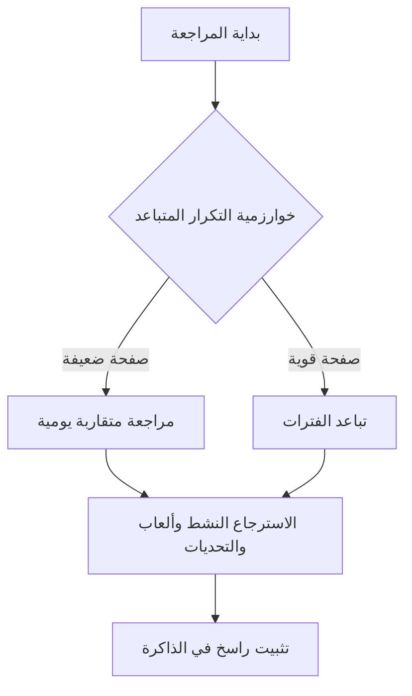
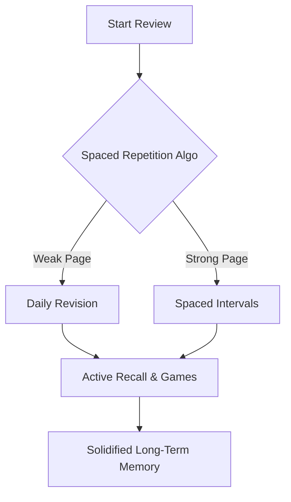

# رصين 🚀✨

> "تعاهدوا هذا القرآن، فوالذي نفس محمد بيده لهو أشد تفلتاً من الإبل في عقلها"

# Raseen 🚀✨

> "Commit yourself to the Quran, for by Him in Whose Hand is my soul, it slips away faster than a camel from its binding."

---

## روابط التحميل المباشر

يسرنا توفير نسخ التشغيل الجاهزة للتحميل المباشر للتطبيق دون الحاجة لخطوات بناء معقدة:
- نسخة أجهزة الكمبيوتر: لتشغيل التطبيق كبرنامج مستقل على نظام ويندوز، يمكنك تحميل ملف التثبيت المباشر للكمبيوتر.
- نسخة الهواتف الذكية: لتشغيل التطبيق على هاتف المحمول، يمكنك تحميل ملف التثبيت المباشر للأندرويد وتثبيته فوراً.
الرابط الرسمي لكافة الإصدارات والملفات: [صفحة إصدارات المشروع على غيت هاب](https://github.com/waleed-kasim/Tathbeet/releases)

## Direct Download Links

We are pleased to provide pre-built binaries for direct installation:
- **Desktop Version (Windows):** Download the standalone installer package (`.exe`) to run the application natively on your computer.
- **Mobile Version (Android):** Download the mobile installer package (`.apk`) and load it directly onto your smartphone.
Official Releases & Assets Page: [Project Releases Page on GitHub](https://github.com/waleed-kasim/Tathbeet/releases)

---

## أهلاً بالحفّاظ

أهلاً بك في تطبيق رصين (المشروع الذي ولد من قلب المعاناة اليومية والجهاد المستمر لكل حافظ للقرآن الكريم). جميعنا يدرك ذلك الشعور الممزوج بالمهابة والأسف حين تفتح المصحف لتكتشف أن الصفحة التي بذلت جهداً كبيراً في حفظها الأسبوع الماضي قد تفلتت من ذاكرتك (هنا قررنا ألا نقف مكتوفي الأيدي، فدمجنا بركة السعي القرآني وقداسته مع قوة الخوارزميات البرمجية الحديثة). رصين ليس مجرد تطبيق تسميع تقليدي أو جدول متابعة عادي، بل هو سلاحك التقني الذكي الذي يضمن ترسيخ حفظك في الذاكرة طويلة المدى باستخدام تقنيات الاسترجاع النشط والتكرار المتباعد. إذ يهدف المشروع لبناء علاقة قوية وراسخة مع كتاب الله بأسلوب ذكي ومرن وتقنيات حديثة!

## Welcome, Memorizers

Welcome to **Raseen**! The application born out of the daily struggle of every Quran memorizer. We all know that feeling of awe and regret when you open the Mus'haf and realize the page you spent hours memorizing last week has slipped away from your memory! Here, we decided to act, blending the divine blessings (barakah) of Quranic pursuit with the power of modern software algorithms. **Raseen** is not just another basic tracking app; it is your ultimate tech companion designed to lock your memorization into long-term memory using Active Recall and Spaced Repetition. Let's build a rock-solid relationship with the Book of Allah in a sleek, modern way!

---

## فكرة التطبيق وأهدافه

### من الحفظ المؤقت إلى التثبيت الدائم

الهدف الأسمى هنا هو الانتقال بالمتدرب من مرحلة الحفظ غير المستقر إلى مرحلة الإتقان والراسخ كالجبال. التطبيق مصمم خصيصاً لخدمة مرحلة ما بعد الحفظ الأولي. أهدافنا واضحة، محددة، ومباشرة:
- تثبيت المتشابهات اللفظية: التغلب على اللبس والتداخل بين الآيات المتقاربة لفظياً من خلال حصرها وإعطاء كل متشابهة علامات تميزها.
- الربط البصري والذهني: تدريب العقل على الانتقال السلس والتلقائي بين نهاية كل صفحة وبداية الصفحة التي تليها دون انقطاع أو تلكؤ.
- تحسين كفاءة الوقت والجهد: المراجعة بذكاء وعبر خوارزميات مدروسة بحيث تركز طاقتك الذهنية على الصفحات التي تحتاج فعلياً للمراجعة والتسميع، وتوفر وقتك في الصفحات الراسخة والمتقنة.

## Concept & Core Goals

### From Temporary Storage to Permanent Solidification

The ultimate goal here is transitioning from the shaky memorization phase to complete and solid mastery. The app is specifically designed for the post-initial memorization stage. Our objectives are clear, specific, and direct:
- **Solidifying Similarities (Mutashabihat):** Overcoming confusion between closely phrased verses through systematic grouping and distinctive markers.
- **Visual & Cognitive Anchoring:** Training your mind to transition seamlessly from the end of one page to the beginning of the next without interruption.
- **Optimized Efficiency:** Reviewing smarter, not harder. You direct your mental energy to the pages that genuinely need revision, saving time on those already consolidated.

---

## الخلطة السحرية: التقنيات العلمية



### الاسترجاع النشط

يركز تطبيقنا على بذل مجهود حقيقي لاسترجاع الآيات والمعلومات (حيث أثبتت الدراسات أن هذه الطريقة أفضل لتثبيت الحفظ من مجرد القراءة المتكررة). إن الألعاب والتحديات المتوفرة تحفز العقل وتنشئ مسارات عصبية قوية للآيات، مما يضمن تثبيتها واستقرارها بشكل عملي وفعال.

### التكرار المتباعد

نحن نعتمد نظام مراجعة ذكي وموزع بدلاً من مراجعة كل شيء يومياً (حيث يضمن هذا النظام توجيه جهدك للمواضع الأكثر حاجة وتوفير وقتك للصفحات المتقنة). يستخدم التطبيق خوارزمية ذكية لاختيار وتوزيع عشوائي مرجح متعدد الأحواض، حيث يقيس التطبيق مستوى تمكنك من الحفظ ويصنف الصفحات المحفوظة إلى ستة أحواض برمجية مختلفة وهي حوض التقاطع (للصفحات المشتركة في حوضين أو أكثر ولها الأولوية الكبرى)، وحوض المحاصرة (للصفحة الضعيفة بين صفحتين قويتين)، وحوض المستحقة (للصفحات التي حان وقت مراجعتها)، وحوض الخطر (للصفحات ذات التكرار الضعيف أو كثيرة التعثر)، وحوض الجديدة (للصفحات المضافة حديثاً)، وحوض الظل (للصفحات المستقرة جداً ذات الفترات الطويلة). يتم التنقل والاختيار بين هذه الأحواض بنسب مئوية وأوزان عشوائية ذكية، ثم تُختار الصفحة المراد مراجعتها بناءً على أوزان تفاعلية كعدد أيام التأخر وعامل سهولة الصفحة وسرعة إتقان السورة، مما يضمن تكراراً مرناً يكسر روتين التكرار التقليدي ويراعي عامل العشوائية والفروق الفردية.

## The Magic Mix: Scientific Techniques



### Active Recall

Our app focuses on active retrieval, encouraging your brain to make a real effort to recall verses and information (which scientific research has shown to be far superior to simple repetitive reading for long-term retention). The interactive challenges stimulate cognitive processes, creating strong neural pathways for the verses, making memorization stick in a practical and effective way.

### Spaced Repetition

We implement an optimized, distributed review schedule instead of reviewing everything daily (this channels your energy to the pages that need it most, preserving time for consolidated pages). The app utilizes a Stochastic Multi-Pool Selection Algorithm that classifies pages into six dynamic pools based on your performance: `intersection` (shared pages between two or more pools, highest weight: 100), `besieged` (weak pages sandwiched between strong ones, weight: 80), `due` (pages scheduled for review, weight: 60), `risk` (pages with poor history or high failures, weight: 25), `new` (newly added pages, weight: 15), and `shadow` (stable pages with long intervals, weight: 5). Selection between these pools is performed via a weighted roulette mechanism, and within the chosen pool, the specific page is selected using dynamic weights (days overdue, ease factor, and Surah completion status). This non-deterministic system ensures a flexible workflow that integrates randomness to prevent repetitive review routines.

---

## أقسام التطبيق بالتفصيل

### المراجعة الذكية

هذه هي لوحة التحكم المركزية لعمليات التثبيت والضبط والتسميع المخفي. بمجرد دخولك، يعرض التطبيق صفحتك المحددة برمجياً بناءً على خوارزمية التكرار المتباعد. في هذا القسم، تظهر الكلمات مخفية بالكامل وتبدأ في الانكشاف كلمة بكلمة إما يدوياً بالنقر أو تلقائياً بنظام التوقيت الذكي الذي يزن الكلمة القرآنية بناءً على طولها وصعوبتها وموقعها القرآني. كما يمكنك إضافة تأملاتك وملاحظاتك الشخصية، أو تمييز متشابهاتها اللفظية فوراً.

### المراجعة العادية

مصحف رقمي تفاعلي سريع ومريح للعين والقلب لقراءة القرآن بصفحات كاملة دون حجب أو إخفاء للكلمات. يتيح لك هذا القسم تصفح المصحف وقراءة محفوظاتك كأي مصحف ورقي تقليدي، مع ميزة فريدة لتعتيم الأجزاء غير المحفوظة فقط في الصفحات المشتركة لتنبيهك. بعد الانتهاء من قراءة الصفحة، تقوم بتقييم حفظك ذاتياً من واحد إلى خمسة (ممتاز، سهل، جيد، صعب، نسيت) لتقوم خوارزمية التكرار المتباعد بإعادة جدولة الصفحة تلقائياً.

### أدوات المساعدة

واجهة التطبيق مقسمة بأسلوب شبكة بينتو لتقدم لك أدوات مساعدة ترفع من جودة قراءتك وفهمك:
- المتشابهات: أداة تفاعلية متطورة تعتمد على النظام المداري الكوني لتفكيك الآيات المتشابهة لفظياً، حيث تظهر بطاقة مركزية ومحيط مداري يحتوي على كرات تفاعلية قابلة للسحب والإفلات توضح لك الفروق اللفظية والخرائط الذهنية والقواعد الضابطة لكل متشابهة لتثبيتها دون ارتباك.
- المواضيع: لربط الحفظ بالفهم والتدبر. نقسم لك الصفحات والسور حسب الموضوعات والقصص القرآنية، حيث يفتح لك كل موضوع بناءً على حفظك لصفحاته المرتبطة.
- عرض الروابط: نعرض لك الروابط الذهنية التي تربط نهاية الصفحة بالصفحة التي تليها لتلافي الانقطاع أو التلعثم عند قلب الصفحات.

## App Modules in Detail

### Smart Review

This is the central control panel for revision and masked self-recitation. Once opened, the algorithm presents the optimal page selected for review. Words are hidden by default and unmask word-by-word either manually by tapping or automatically via Smart Timing, which computes reading delay based on word length, complexity, and Quranic accents. You can also attach personal reflections and note similar verses immediately.

### Regular Review

An interactive digital Mus'haf optimized for comfortable reading. Unlike the smart review, this displays the pages fully without any word masking or hiding. It functions as a traditional Mus'haf reader, with a helper feature that blurs non-memorized sibling chunks in shared pages. After reading, you self-evaluate your retention from 1 to 5 (Excellent, Easy, Good, Hard, Forgotten) to recalibrate the next review interval.

### Bento Auxiliary Tools

The UI utilizes a Bento Grid layout to offer tools that elevate comprehension and retention:
- **Similarities (Mutashabihat):** Advanced cosmic orbital interface where you drag and drop interactive satellites representing visual layout, Surah context, verse endings, and memorization rules to clear any confusion between closely phrased verses.
- **Thematic Blocks (Themes):** Connecting retention with understanding. We partition Surahs into thematic blocks that unlock dynamically as you memorize the corresponding pages.
- **Links View:** Displaying visual and mental anchors that link the last verse of a page to the first verse of the next for uninterrupted transitions.

---

## ألعاب التحدي وتنشيط الذاكرة

القسم المفضل للجميع! لقد حولنا عملية التثبيت التقليدية والمكررة إلى تحديات تفاعلية وألعاب ذهنية تنشط العقل وتختبر قوة حفظك من زوايا مختلفة وجديدة تضمن عدم ملل الحافظ وتزيد من سرعة بديهته، حيث تعتمد جميع هذه الألعاب على نمط الاختيار من متعدد لتسهيل المراجعة وتأكيد الإجابات دون الحاجة إلى تعرف صوتي على الكلام أو عمليات كتابة معقدة:

١. تعرف على الصفحة: يعرض عليك التطبيق النص الكامل لصفحة قرآنية، وعليك تحديد رقم الصفحة الصحيح من بين أربعة خيارات أرقام صفحات معروضة لبناء ذاكرة بصرية قوية لموقع الصفحة.

٢. تحدي الترتيب: يعرض عليك التطبيق نصين عشوائيين من صفحتين محفوظتين، ومهمتك هي تحديد أيهما تأتي أولاً في المصحف من خلال الاختيار بينهما لمعرفة الترابط التتابعي للصفحات.

٣. السابق واللاحق: يعرض لك التطبيق آية معينة، ويتوجب عليك تحديد الآية السابقة لها مباشرة والآية اللاحقة لها من خلال اختيار الإجابة الصحيحة من عمودين يحتوي كل منهما على أربعة خيارات من متعدد لضبط تماسك الآيات.

٤. ما الأول: يعرض لك التطبيق الآية الأخيرة من صفحة معينة ورقمها، ويطلب منك تحديد الآية الأولى التي تبدأ بها هذه الصفحة من بين أربعة خيارات نصية لضبط بداية الصفحات.

٥. ما الأخير: يعرض لك التطبيق الآية الأولى من صفحة معينة ورقمها، ويطلب منك تحديد الآية الأخيرة التي تنتهي بها هذه الصفحة من بين أربعة خيارات نصية لضبط نهايات الصفحات.

٦. رقم الآية: تحدي الربط الرقمي الدقيق، حيث يعرض عليك التطبيق آية معينة ويطلب منك تحديد رقمها الصحيح من بين أربعة خيارات أرقام.

٧. الآية من الرقم: يعرض عليك التطبيق سورة ورقم آية ورقم صفحة، ويتحداك لتحديد نص الآية المطابق والمناسب لها تماماً من بين أربعة خيارات نصوص معروضة.

٨. اختبار الروابط: يعرض لك التطبيق الآية الأخيرة من صفحة معينة، وعليك اختيار الآية الأولى التي تبدأ بها الصفحة التالية مباشرة من بين أربعة خيارات لتأكيد روابط نهايات وبدايات الصفحات.

## Challenge Games

We transformed routine revision into engaging cognitive games that test your recall from different angles. All these games are designed strictly around multiple-choice questions to facilitate learning and ensure quick retention without requiring voice recognition or typing:

1. **Page Recognition:** The game shows the full text of a page and challenges you to identify the correct page number from four multiple-choice options.
2. **Sequence & Ordering:** Displays random snippets from two different pages and asks you to select which page comes first in the Mus'haf layout (2 options).
3. **Prev & Next:** Displays a verse and prompts you to select its immediate preceding and succeeding verses from two separate 4-option lists.
4. **First Ayah:** Shows the last verse of a page and quizzes you on its absolute first verse, selected from four options.
5. **Last Ayah:** Shows the first verse of a page and quizzes you on its absolute last verse, selected from four options.
6. **Ayah to Number:** Displays a verse text and asks you to select its exact verse number from four options.
7. **Number to Ayah:** Provides a Surah name, page number, and verse number, prompting you to choose the correct corresponding verse text from four options.
8. **Links Quiz:** Shows the last verse of page N and prompts you to select the correct starting verse of page N+1 from four options.

---

## المكونات التقنية والبناء

تم بناء التطبيق بهيكل حديث ومتين يضمن تشغيله كبرنامج لسطح المكتب أو كتطبيق للهواتف الذكية بكفاءة وسرعة فائقتين:
- بيئة العمل الأساسية: ريأكت تسعة عشر مدعوماً بأداة فايت لضمان سرعة التحميل الفورية وتحديث العناصر بسلاسة تامة دون استهلاك موارد الجهاز.
- التنسيق والتصميم: تخصيص صفحات التنسيق النقي مع مرونة تصميم شبكة بينتو الجذاب بألوان هادئة ومريحة للعين أثناء القراءة الليلية الطويلة وساعات المراجعة.
- برنامج سطح المكتب: ملفات التشغيل في مجلد إليكترون تسمح بتهيئة وبناء نسخة متكاملة لأجهزة الكمبيوتر (ويندوز وماك).
- تطبيق الهواتف الذكية: إعدادات ملف كاباسيتور تتيح مزامنة الكود وبنائه مباشرة كتطبيق أندرويد متكامل وقابل للتشغيل الفوري.

## System Architecture & CLI Build

The application features a modern, clean architecture ensuring high performance across desktop and mobile platforms:
- **Core Runtime:** React 19 powered by Vite, guaranteeing instant startup and smooth rendering with zero lag.
- **Styling & UI:** Vanilla CSS custom theme with a gorgeous Bento design, featuring soothing color palettes perfect for night-time reading.
- **Desktop Wrapper (Electron):** Main process and preload logic located in the `electron/` directory to build fully native desktop apps.
- **Mobile Runtime (Capacitor):** Out-of-the-box configurations in `capacitor.config.ts` syncing code to package a full Android apk.

---

### أوامر التطوير والتشغيل

يمكنك تشغيل وبناء المشروع محلياً باستخدام الأوامر التالية في سطر الأوامر الخاص بك:

- تشغيل خادم التطوير المحلي:
  ```bash
  npm run dev
  ```
  (يفتح التطبيق محلياً على المنفذ ثلاثين ثلاثين مع ميزة المزامنة السريعة والتحديث الفوري للتعديلات)

- تشغيل نسخة سطح المكتب تجريبياً:
  ```bash
  npm run electron
  ```
  (يفتح التطبيق في نافذة مستقلة كبرنامج أصيل على جهاز الكمبيوتر)

- بناء نسخة إليكترون النهائية:
  ```bash
  npm run dist
  ```
  (يقوم ببناء ملفات الويب ثم تجميعها وتغليفها كبرنامج تثبيت جاهز لنظام التشغيل)

- مزامنة وبناء تطبيق الأندرويد:
  ```bash
  npm run android:full-build
  ```
  (أمر متكامل يقوم ببناء ملفات الويب، ومزامنتها مع مجلد الأندرويد، ثم تشغيل أداة جرادل لإنتاج ملف تثبيت جاهز للتثبيت المباشر على هاتفك)

### CLI Scripts

You can run, test, and build the project locally using the following package scripts:

- Local Dev Server:
  ```bash
  npm run dev
  ```
  *(Spins up the web application on port 3030 with Hot Module Replacement)*

- Electron Run:
  ```bash
  npm run electron
  ```
  *(Opens the app in a standalone native OS window)*

- Desktop Build:
  ```bash
  npm run dist
  ```
  *(Compiles web files and packages them into a distributable desktop installer)*

- Android Full Sync & Build:
  ```bash
  npm run android:full-build
  ```
  *(A unified script that builds web code, syncs it with the Android native project, and invokes Gradle to assemble a debug APK!)*

---

> دعواتكم الصادقة لنا بظهر الغيب، ونسأل الله أن يجعل هذا العمل خالصاً لوجهه الكريم وأن ينفع به الحفاظ والمراجعين في مشارق الأرض ومغاربها.

> 💌 We humbly request your prayers. May Allah accept this work sincerely for His sake, and make it a source of benefit for Quran memorizers worldwide.
