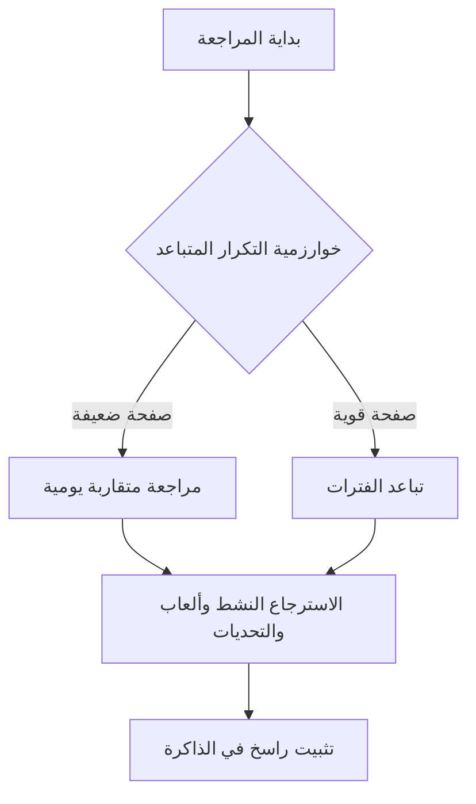
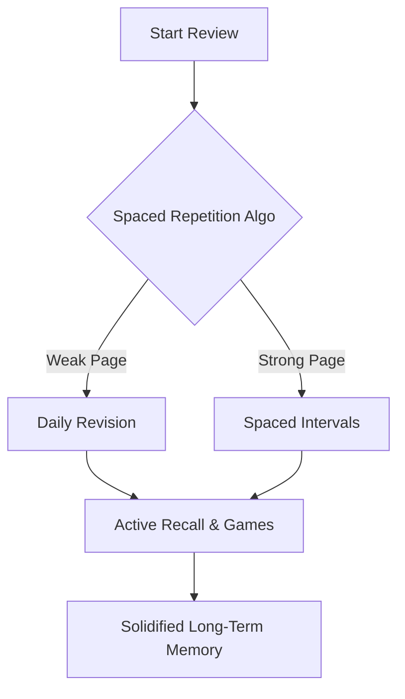

# رصين

> "تعاهدوا هذا القرآن، فوالذي نفس محمد بيده لهو أشد تفلتاً من الإبل في عقلها"

# Raseen

> "Commit yourself to the Quran, for by Him in Whose Hand is my soul, it slips away faster than a camel from its binding."

---

## روابط التحميل المباشر

يسرنا توفير نسخ التشغيل الجاهزة للتحميل المباشر للتطبيق دون الحاجة لخطوات بناء معقدة (الروابط الرسمية للتحميل متوفرة في القسم الإنجليزي أدناه)

- نسخة أجهزة الكمبيوتر: لتشغيل التطبيق كبرنامج مستقل على نظام ويندوز (يمكن تحميل ملف التثبيت المباشر للكمبيوتر من روابط التحميل أدناه)
- نسخة الهواتف الذكية: لتشغيل التطبيق على الهاتف المحمول (يمكن تحميل ملف التثبيت المباشر للأندرويد وتثبيته فوراً من روابط التحميل أدناه)

## Direct Download Links

We are pleased to provide pre-built binaries for direct installation:

- **Desktop Version (Windows):** Download the standalone installer package (`.exe`) to run the application natively on your computer: [Download Windows Installer](https://github.com/waleed-kasim/Tathbeet/releases)
- **Mobile Version (Android):** Download the mobile installer package (`.apk`) and load it directly onto your smartphone: [Download Android APK](https://github.com/waleed-kasim/Tathbeet/releases)

---

## أهلاً بالحفّاظ

تطبيق رصين هو نظام برمجى مخصص لمساعدة حفاظ القرآن الكريم على ترسيخ وتثبيت حفظهم وتفادي النسيان. يدمج التطبيق بين المنهجية القرآنية التقليدية والحلول البرمجية الحديثة لتقديم تجربة مراجعة متكاملة. لا يقتصر رصين على المتابعة التقليدية، بل يوفر بيئة تقنية لترسيخ الحفظ في الذاكرة طويلة المدى بالاعتماد على تقنيات الاسترجاع النشط والتكرار المتباعد، مما يضمن الاستمرارية والفاعلية في تثبيت الآيات بأسلوب مرن ومنظم.

## Welcome, Memorizers

**Raseen** is a software system designed to help Quran memorizers consolidate their memorization and prevent retention loss. By combining traditional Quranic review practices with modern software algorithms, Raseen provides a structured technical environment to secure memorization in long-term memory. Using Active Recall and Spaced Repetition, the application optimizes the review workflow to ensure flexibility, high efficiency, and sustainable retention.

---

## فكرة التطبيق وأهدافه

### من الحفظ الأولي إلى الإتقان الدائم

يهدف التطبيق إلى نقل المستخدم من مرحلة الحفظ غير المستقر إلى مرحلة الإتقان والضبط. تم تصميم رصين لخدمة مرحلة ما بعد الحفظ الأولي من خلال الأهداف التالية:

- ضبط المتشابهات اللفظية: حل إشكالية التداخل بين الآيات المتقاربة لفظيا عبر حصرها وتحديد الفروق الدقيقة بينها.
- الربط البصري والذهني: تدريب الذهن على الانتقال السلس بين نهاية كل صفحة وبداية الصفحة التالية لضمان التدفق المستمر أثناء التلاوة.
- رفع كفاءة المراجعة: توجيه الجهد الذهني نحو الصفحات التي تحتاج للمراجعة الفعالية اعتمادا على خوارزميات قياس الأداء وتوفير الوقت المستهلك في الصفحات المتقنة.

## Concept & Core Goals

### From Initial Memorization to Long-Term Mastery

The primary objective is to transition the user from unstable memorization to complete mastery. Raseen is engineered specifically for the post-initial memorization phase:

- **Solidifying Similarities (Mutashabihat):** Resolving confusion between closely phrased verses through systematic identification and categorization.
- **Visual & Cognitive Anchoring:** Training the mind to transition seamlessly from the end of one page to the beginning of the next to prevent hesitation.
- **Optimizing Review Efficiency:** Directing mental effort toward pages requiring urgent revision based on automated evaluation, reducing redundant reviews of consolidated pages.

---

## الأسس العلمية والمنهجية



### الاسترجاع النشط

يعتمد التطبيق على مبدأ الاسترجاع النشط عبر استثارة الذاكرة لاستدعاء الآيات بدلا من القراءة السلبية المتكررة. تساعد الألعاب والتدريبات التفاعلية المدمجة على تنشيط الروابط الذهنية الخاصة بالنصوص القرآنية، مما يعزز ترسيخها في الذاكرة طويلة المدى بشكل عملي.

### التكرار المتباعد

يطبق النظام خوارزمية متطورة لتوزيع فترات المراجعة وتجنب هدر الجهد اليومي في الصفحات المتقنة. تعتمد الخوارزمية على تصنيف الصفحات المحفوظة ديناميكيا إلى ستة أحواض برمجية رئيسية:
- حوض التقاطع: يضم الصفحات المشتركة بين تصنيفين أو أكثر وتمنح له الأولوية القصوى.
- حوض المحاصرة: يضم الصفحة الضعيفة الواقعة بين صفحتين قويتين لضمان عدم تفلتها.
- حوض المستحقة: يضم الصفحات التي حان موعد مراجعتها وفقا لجدول زمني مرن.
- حوض الخطر: يشتمل على الصفحات ذات معدلات التعثر المرتفعة أو التكرار الضعيف.
- حوض الجديدة: يضم الصفحات المضافة حديثا لضمان تثبيتها الأولي.
- حوض الظل: مخصص للصفحات المستقرة ذات الفترات المتباعدة جدا.

تدار عملية الاختيار والتنقل بين هذه الأحواض عبر آلية عشوائية مرجحة (عجلة الروليت). ويتم انتقاء الصفحات داخل كل حوض بناء على مصفوفة أوزان تفاعلية تشمل: عدد أيام التأخر، وعامل السهولة، ونسبة إنجاز السورة، مما يوفر نظام مراجعة مرن يراعي الفروق الفردية ويحد من التكرار النمطي.

## Methodology & Scientific Foundations



### Active Recall

Raseen prioritizes active retrieval to stimulate memory reconstruction instead of passive repetitive reading. Interactive challenges reinforce neural pathways associated with Quranic text, maximizing long-term cognitive consolidation.

### Spaced Repetition

The system implements a Stochastic Multi-Pool Selection Algorithm to optimize review intervals and direct effort away from consolidated material. Memorized pages are classified into six dynamic pools:
- **Intersection:** Shared pages between multiple conditions (highest priority, weight: 100).
- **Besieged:** Weak pages sandwiched between two strong pages (weight: 80).
- **Due:** Pages scheduled for review based on dynamic interval tracking (weight: 60).
- **Risk:** Pages with a history of high failure rates or low recall frequency (weight: 25).
- **New:** Recently added pages undergoing initial stabilization (weight: 15).
- **Shadow:** Stable pages with maximized intervals (weight: 5).

Selection between these pools is performed via a weighted roulette mechanism. Within the chosen pool, individual pages are selected using dynamic weights (days overdue, ease factor, and Surah completion status). This non-deterministic scheduler prevents routine fatigue while adapting to individual retention curves.

---

## أقسام التطبيق بالتفصيل

### المراجعة الذكية

تمثل المراجعة الذكية لوحة التحكم المخصصة للتسميع الذاتي واختبار قوة الحفظ. يعرض التطبيق الصفحة المحددة بناء على خوارزمية التكرار المتباعد، وتظهر الكلمات محجوبة بالكامل. تنكشف الكلمات تتابعا إما يدويا عن طريق النقر أو تلقائيا عبر محرك التوقيت الذكي الذي يحسب زمن ظهور الكلمة تبعا لطولها، ودرجة صعوبتها، وموقعها الإعرابي والقرآني. تتيح هذه الواجهة أيضا تدوين الملاحظات والروابط الذهنية وتحديد المتشابهات اللفظية بشكل فوري.

### المراجعة العادية

واجهة قراءة رقمية تعرض صفحات المصحف كاملة دون حجب للكلمات، وتقدم تجربة تصفح تفاعلية ومريحة للعين. توفر المراجعة العادية ميزة تعتيم الأجزاء غير المحفوظة في الصفحات المشتركة لتوجيه انتباه القارئ. يقوم المستخدم بعد إتمام القراءة بتقييم مستوى حفظه ذاتيا من درجة واحدة إلى خمس درجات (ممتاز، سهل، جيد، صعب، نسيت)، ليعاد جدولة الصفحة تلقائيا بناء على هذا التقييم.

### أدوات المساعدة

تم تصميم واجهة الأدوات المساعدة وفق نمط شبكة بينتو لتسهيل الوصول للمزايا التالية:
- المتشابهات: أداة متطورة تعتمد على نموذج النظام المداري الكوني لتفكيك الآيات المتشابهة لفظيا. تعرض الأداة بطاقة مركزية ومحيطا مداريا يحتوي على كرات تفاعلية قابلة للسحب والإفلات توضح الفروق اللفظية، والخرائط الذهنية، والقواعد الضابطة لكل آية متشابهة لتجنب التداخل.
- المواضيع: أداة لربط الحفظ بالفهم والتدبر، حيث يتم تقسيم السور والصفحات تبعا للموضوعات والقصص القرآنية، وتتاح هذه الموضوعات للمستخدم تدريجيا وفق تقدمه في الحفظ.
- عرض الروابط: تعرض الأداة الروابط الذهنية واللفظية التي تربط نهاية كل صفحة ببداية الصفحة التالية لتفادي التلعثم أو الانتقال أثناء الانتقال بين الصفحات.

## App Modules in Detail

### Smart Review

The central interface for active recall and masked self-recitation. The application displays the designated review page with all words hidden. Words are unmasked sequentially either manually via user interaction or automatically through the Smart Timing engine. This engine calculates word display duration based on word length, complexity, and Quranic accents. Users can also record personal notes, cognitive anchors, and identify similar verses.

### Regular Review

An interactive digital Mus'haf optimized for traditional reading, displaying pages fully without word masking. It features visual blurring of non-memorized sibling chunks in shared pages to maintain focus. Upon completing a page, the user self-evaluates retention on a 1-to-5 scale (Excellent, Easy, Good, Hard, Forgotten), which triggers the spaced repetition algorithm to recalibrate the next review interval.

### Bento Auxiliary Tools

Organized in a Bento Grid layout, this module provides key features to enhance comprehension and retention:
- **Similarities (Mutashabihat):** An advanced cosmic orbital interface where users drag and drop interactive satellites representing visual layouts, Surah contexts, verse endings, and memorization rules to resolve confusion between closely phrased verses.
- **Thematic Blocks (Themes):** Connects memorization with thematic structure. Surahs are divided into contextual blocks that unlock dynamically as corresponding pages are memorized.
- **Links View:** Displays cognitive and visual anchors that connect the final verse of a page to the first verse of the next, preventing hesitation during page transitions.

---

## ألعاب التحدي وتنشيط الذاكرة

يتضمن التطبيق قسما خاصا بالاختبارات التفاعلية المصممة لقياس جودة الحفظ من زوايا متعددة وتنشيط الذاكرة البصرية واللفظية. تعتمد جميع الألعاب على نمط الاختيار من متعدد لتسهيل المراجعة وتأكيد الإجابات دون الحاجة إلى معالجة الصوت أو الكتابة اليدوية:

١. تعرف على الصفحة: يعرض التطبيق النص الكامل لصفحة قرآنية، ويتعين على المستخدم تحديد رقم الصفحة الصحيح من بين أربعة خيارات لبناء ذاكرة بصرية لمواقع الصفحات.
٢. تحدي الترتيب: يعرض التطبيق مقطعين عشوائيين من صفحتين محفوظتين، والمطلوب هو تحديد الصفحة التي تسبق الأخرى في ترتيب المصحف من خلال الاختيار بينهما لضبط التتابع.
٣. السابق واللاحق: يعرض التطبيق آية محددة، ويطلب من المستخدم اختيار الآية السابقة لها والآية اللاحقة لها مباشرة من قائمتين منفصلتين تحتوي كل منهما على أربعة خيارات.
٤. ما الأول: يعرض التطبيق الآية الأخيرة من صفحة معينة ورقمها، ويطلب تحديد الآية الأولى التي تبدأ بها تلك الصفحة من بين أربعة خيارات نصية لضبط بدايات الصفحات.
٥. ما الأخير: يعرض التطبيق الآية الأولى من صفحة معينة ورقمها، ويطلب تحديد الآية الأخيرة التي تنتهي بها تلك الصفحة من بين أربعة خيارات نصية لضبط نهايات الصفحات.
٦. رقم الآية: تحدي الربط الرقمي، حيث يعرض التطبيق آية قرآنية ويطلب تحديد رقمها الصحيح من بين أربعة خيارات رقمية.
٧. الآية من الرقم: يعرض التطبيق اسم السورة ورقم الآية ورقم الصفحة، ويطلب تحديد النص المطابق للآية تماما من بين أربعة خيارات نصية.
٨. اختبار الروابط: يعرض التطبيق الآية الأخيرة من صفحة معينة، ويتعين على المستخدم تحديد الآية الأولى من الصفحة التالية مباشرة من بين أربعة خيارات لتأكيد روابط بدايات ونهايات الصفحات.

## Challenge Games

Raseen features interactive quizzes designed to evaluate memorization quality and stimulate visual and verbal recall. All games are strictly structured around multiple-choice questions to streamline review and confirmation without requiring speech recognition or typing:

1. **Page Recognition:** Displays the full text of a page and prompts the user to identify the correct page number from four options.
2. **Sequence & Ordering:** Displays random snippets from two memorized pages and asks the user to determine which page precedes the other in the Mus'haf layout.
3. **Prev & Next:** Displays a verse and requires the user to select its immediate preceding and succeeding verses from two separate four-option lists.
4. **First Ayah:** Shows the last verse of a page and its page number, prompting the user to select the first verse of that page from four options.
5. **Last Ayah:** Shows the first verse of a page and its page number, prompting the user to select the last verse of that page from four options.
6. **Ayah to Number:** Displays a verse and asks the user to select its exact verse number from four options.
7. **Number to Ayah:** Provides a Surah name, page number, and verse number, requiring the user to identify the correct verse text from four options.
8. **Links Quiz:** Shows the last verse of page N and requires the user to select the starting verse of page N+1 from four options.

---

## المكونات التقنية والبناء

تم بناء التطبيق بالاعتماد على بنية برمجية حديثة تضمن الأداء العالي والاستجابة السريعة على منصات سطح المكتب والهواتف الذكية:

- بيئة التشغيل الأساسية: ريأكت تسعة عشر مع أداة فايت لضمان سرعة التحميل الفوري وتحديث واجهة المستخدم بكفاءة عالية وبأقل استهلاك للموارد.
- التنسيق والتصميم: صفحات تنسيق نقية لتصميم واجهة شبكة بينتو المتميزة بألوان متناسقة ومناسبة لظروف القراءة المختلفة.
- تطبيق سطح المكتب: يعتمد على إطار عمل إليكترون لتجميع وتشغيل التطبيق كبرنامج أصيل مستقل متوافق مع نظام ويندوز.
- تطبيق الهواتف الذكية: يستخدم منصة كاباسيتور لمزامنة كود الويب وتصديره مباشرة كتطبيق أندرويد متكامل.

## System Architecture & CLI Build

The application is built on a modern stack designed for high-performance execution across desktop and mobile environments:

- **Core Runtime:** React 19 powered by Vite for fast hot reloading, minimized build size, and optimized UI updates.
- **Styling & UI:** Written in vanilla CSS with a responsive Bento Grid design, offering a dark-mode friendly palette.
- **Desktop Wrapper (Electron):** Main process and preload logic located in the `electron/` directory to compile native desktop binaries.
- **Mobile Runtime (Capacitor):** Out-of-the-box configurations in `capacitor.config.ts` syncing code to package a full Android apk.

---

### أوامر التشغيل والبناء

يمكن تشغيل وبناء المشروع محليا من خلال تنفيذ الأوامر التالية في واجهة السطر البرمجي:

- تشغيل خادم التطوير المحلي:

```bash
npm run dev
```

  (لتشغيل نسخة الويب محليا مع دعم التحديث الفوري للتعديلات)

- تشغيل نسخة سطح المكتب تجريبيا:

```bash
npm run electron
```

  (لتشغيل التطبيق داخل نافذة مستقلة كبرنامج لسطح المكتب)

- بناء نسخة التوزيع لسطح المكتب:

```bash
npm run dist
```

  (لتجميع ملفات المشروع وحزمها في ملف تثبيت جاهز لنظام التشغيل)

- مزامنة وبناء نسخة الأندرويد:

```bash
npm run android:full-build
```

  (أمر متكامل لبناء ملفات الويب، ومزامنتها مع مجلد الأندرويد، وتصدير حزمة التثبيت النهائية للهواتف الذكية)

### CLI Scripts

You can run, test, and build the project locally using the following scripts:

- Local Development Server:

```bash
npm run dev
```

  _(Spins up the web application with Hot Module Replacement)_

- Desktop Runtime Environment:

```bash
npm run electron
```

  _(Opens the application in a standalone native OS window)_

- Desktop Distribution Build:

```bash
npm run dist
```

  _(Compiles web files and packages them into a distributable desktop installer)_

- Android Sync & Build:

```bash
npm run android:full-build
```

  _(Builds web assets, synchronizes with the Android project, and compiles a debug APK)_

---

> دعواتكم الصادقة لنا بظهر الغيب، ونسأل الله أن يجعل هذا العمل خالصاً لوجهه الكريم وأن ينفع به الحفاظ والمراجعين في مشارق الأرض ومغاربها.

> We humbly request your prayers. May Allah accept this work sincerely for His sake, and make it a source of benefit for Quran memorizers worldwide.

