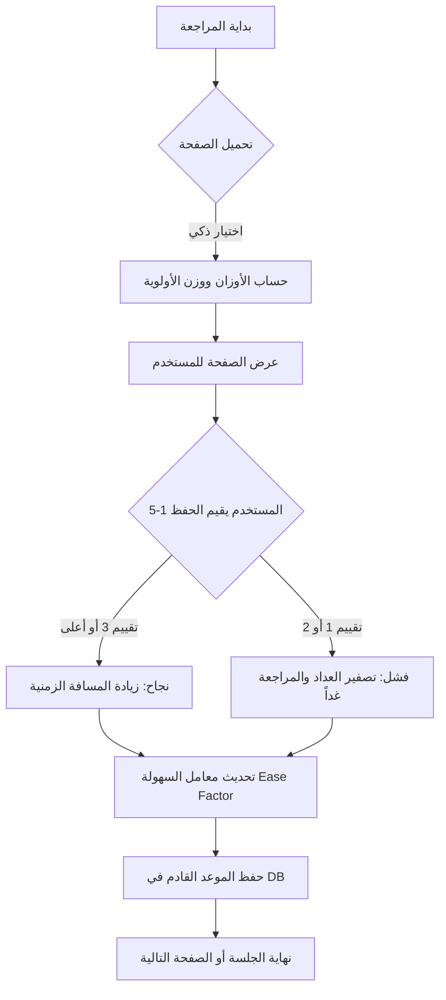

# نظام المراجعة الذكية (SRS): التقرير التقني الشامل

هذا التقرير يشرح "العقل المدبر" لتطبيقك، وهو نظام **التكرار المتباعد (Spaced Repetition System)** المعتمد على خوارزمية **SM-2** ونظام الأوزان لتوزيع العشوائية.

---

## 1. محرك الجدولة (خوارزمية SM-2)

يعتمد النظام على 3 متغيرات أساسية لكل صفحة قرآنية:
1.  **الوقت (Interval):** عدد الأيام حتى المراجعة القادمة.
2.  **التكرار (Repetitions):** عدد المرات التي نجحت فيها في حفظ الصفحة بالتوالي.
3.  **معامل السهولة (Ease Factor):** يحدد مدى سرعة "تباعد" المواعيد. يبدأ بـ **2.5**.

### كيف تتغير البيانات عند التقييم؟

| التقييم | الحالة | تأثيره على الموعد القادم | تأثيره على "معامل السهولة" |
| :--- | :--- | :--- | :--- |
| **5 (ممتاز)** | نجاح تام | يقفز الموعد القادم بعيداً جداً | يزداد بمقدار **0.1** (تصبح المراجعة أبطأ) |
| **4 (سهل)** | نجاح مستقر | يبتعد الموعد القادم بشكل طبيعي | يبقى **ثابتاً** |
| **3 (جيد)** | نجاح حذر | يبتعد الموعد القادم ببطء | ينقص بمقدار **0.22** (تصبح المراجعة أسرع) |
| **1-2 (صعب)** | فشل | يعود الموعد لـ **يوم واحد فقط** | ينقص بمقدار **0.20** (تصبح المراجعة ملحّة) |

> [!NOTE]
> **أرضية الأمان:** معامل السهولة لا يقل أبداً عن **1.3**، لضمان أنك لن تدخل في حلقة مراجعة "لا نهائية" يومية مهما كانت الصفحة صعبة.

---

## 2. نظام العشوائية الذكية (Weighted Randomness)

عند الضغط على "المراجعة الذكية"، لا يختار التطبيق بشكل عشوائي بحت، بل يمنح كل صفحة **ثقلاً (Weight)** بناءً على حالتها:

### حساب الأوزان (بالأرقام):
*   **الصفحة الجديدة (لم تبدأ بها):** تأخذ حوالي **205,000 نقطة** (تأخذ الأولوية الكبرى لتشجيعك على الحفظ الجديد).
*   **الصفحة المستحقة اليوم (Due):** تأخذ **60 نقطة** أساسية + **10 نقاط** عن كل يوم تأخير.
*   **الصفحة غير المستحقة (Future):** تأخذ **1 نقطة** فقط (تظهر نادراً جداً).

---

## 3. مخطط تدفق البيانات (Flowchart)

يوضح الرسم التالي كيف يتفاعل التطبيق مع اختياراتك:

---

## 4. مثال عملي (تتبع المواعيد)

إذا قيمت صفحة لأول مرة بـ **"ممتاز"**:
1.  تراها اليوم.
2.  تراها غداً (مراجعة فورية).
3.  تراها بعد 6 أيام.
4.  تراها بعد 15 يوماً (6 × 2.6).
5.  تراها بعد 40 يوماً (15 × 2.6).

**بينما لو قيمتها "صعبة":**
ستظل تراها يومياً أو كل يومين حتى يبدأ معامل السهولة والنجاح بالتحسن، فتنتقل تدريجياً إلى المواعيد المتباعدة.

---
> [!TIP]
> أفضل طريقة للاستفادة من هذا النظام هي الثقة في زر **"المراجعة الذكية"**، فهو مصمم ليحضر لك "ما أوشك عقلك على نسيانه" في اللحظة المثالية.
